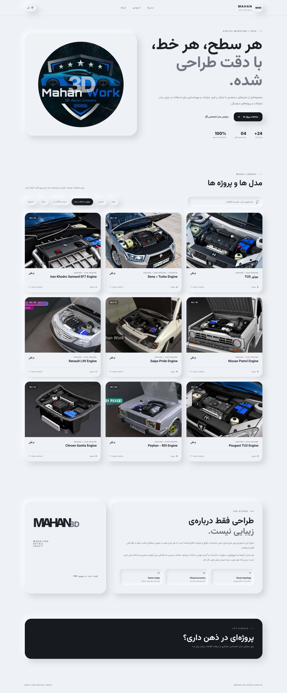
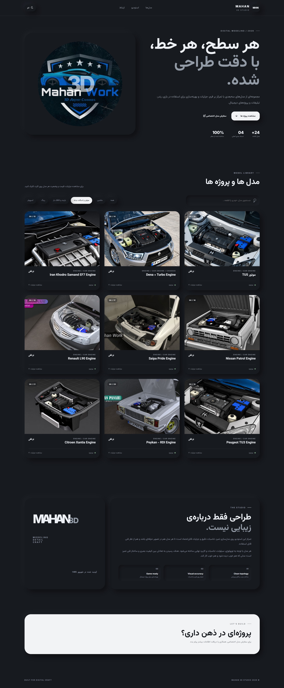

<div align="center">


# MAHAN 3D Studio

### 3D Model Library & Digital Portfolio

A curated archive of 3D models and digital creations by **Mahan Panahi** — built with a focus on clean topology, visual accuracy, detail, and practical digital use.

<p>
  <a href="#-english">English</a>
  &nbsp;•&nbsp;
  <a href="#-فارسی">فارسی</a>
</p>

<br>


</div>

---

# 🇬🇧 English

## ✦ About

**MAHAN 3D Studio** is a personal 3D modeling portfolio and model library created by **Mahan Panahi**.

The website showcases a growing collection of custom 3D models with an emphasis on:

- Accurate proportions
- Clean topology
- Detailed modeling
- Visual quality
- Game-ready optimization
- Practical digital usage

The goal is to create models that are not only visually appealing, but also structured and usable for real digital projects.

---

## ✦ Features

- 🚗 **Vehicle Models** — custom automotive projects
- ⚙️ **Engine & Mechanical Parts** — detailed mechanical assets
- 🛞 **Wheels & Rims** — custom wheel designs
- 🪽 **Spoilers & Aero Parts** — performance-inspired components
- 📦 **Racks & Accessories** — practical vehicle assets
- 🔎 **Search** — quickly find models
- 🗂️ **Category Filtering** — browse models by category
- 🌓 **Light / Dark Theme** — comfortable viewing experience
- 📱 **Responsive Design** — optimized for desktop and mobile
- 🧩 **Model Details** — specifications, pricing and availability

---

## 🖥️ Website Preview

<table>
  <tr>
    <td align="center">
      <strong>Homepage Light Mode</strong>
    </td>
    <td align="center">
      <strong>Homepage Night Mode</strong>
    </td>
  </tr>
  <tr>
    <td>
      
    </td>
    <td>
      
    </td>
  </tr>
</table>

> Place your screenshots inside `assets/screenshots/` with the filenames `home-light.jpg` and `home-night.jpg`.

---

## 🛠️ Built With

| Technology | Purpose |
|---|---|
| **HTML5** | Website structure & semantic markup |
| **CSS3** | Layout, responsive design & visual styling |
| **JavaScript** | Interactions, filtering & dynamic content |
| **Inter** | Latin typography |
| **Vazirmatn** | Persian typography |

---

## 📁 Project Structure

```text
mahan3d-models/
│
├── assets/
│   ├── css/
│   ├── images/
│   │   ├── aero/
│   │   ├── cars/
│   │   ├── engine/
│   │   ├── racks/
│   │   ├── spoiler/
│   │   ├── wheels/
│   │   ├── سایر/
│   │   └── logo.png
│   │
│   ├── js/
│   └── webfonts/
│
├── assets/
│   └── screenshots/
│       ├── home-light.jpg
│       └── home-night.jpg
│
├── index.html
└── README.md